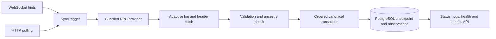

# ReorgGuard

ReorgGuard keeps an application database in step with events on an EVM chain.

Reading logs once is not enough: providers can limit or omit a range, a WebSocket connection can drop, a process can die, and a chain can replace blocks that were already indexed. ReorgGuard fetches filtered logs, proves block ancestry, and updates a durable PostgreSQL canonical view. This repository demonstrates how an indexer can recover without silently skipping events or presenting two competing histories as one.

## Data flow



WebSocket notifications only wake the sync loop. HTTP backfill closes gaps from the last committed checkpoint. Fetching can run concurrently, but validated ranges commit in order; a later range cannot advance the checkpoint past an incomplete earlier one. A reorg marks the old branch non-canonical and atomically projects the replacement, retaining the observations for audit and possible A→B→A recovery.

## Engineering focus

| Problem | Design and resulting behavior |
| --- | --- |
| A provider caps `eth_getLogs` ranges. | Adaptive bounded backfill splits ranges and validates their headers and logs; progress is recorded only for complete ranges. |
| WebSocket delivery is not durable. | Notifications are hints, while HTTP catch-up reads from PostgreSQL's checkpoint; disconnects and restarts do not create a permanent gap. |
| Blocks can be replaced. | Parent hashes prove a bounded common ancestor and one database transaction switches canonical flags, logs, summary, and checkpoint together. |
| A process may stop during a write. | The transaction either commits the contiguous branch or leaves the previous state intact; restart resumes from durable state. |
| A fallback RPC may serve the wrong history. | Chain identity, anchor, checkpoint, completed filtered logs, freshness, and method support are checked before failover. |
| A reorg can invalidate an API page. | Keyset cursors include the canonical revision; an outdated cursor receives HTTP 409 rather than a mixed result. |

The [failure matrix](docs/failure-matrix.md) and [architecture](docs/architecture.md) describe the precise behavior. Automatic recovery stops when ancestry cannot be proved within the configured bound.

## Quick start

Install Go 1.27.1, Docker, Foundry (`anvil`, `forge`, `cast`), Python 3, PostgreSQL command-line tools, `rg`, and `make`. The first run downloads public modules and local test tools. No private chain credentials are required.

```sh
git clone <repository-url> FinalReorgGuard
cd FinalReorgGuard
go mod download
make demo
go test ./...
```

The demo starts disposable PostgreSQL, Anvil, fault proxies, and the real service. It checks backfill, live delivery, WebSocket loss, HTTP gap recovery, A→B→A reorganization, forced restart, RPC failover, API output, and a SQL checksum. See the [demo guide](docs/demo.md). To run the service outside the fixture, start from [.env.example](.env.example) and the [runbook](docs/runbook.md); the default mode performs one HTTP catch-up and exits, while `REORGGUARD_SYNC_MODE=live` enables continuous polling.

For the full local gate, install govulncheck, actionlint, Trivy, and Syft as listed in [test evidence](docs/evidence.md), then run `make verify`. It runs Go tests and race checks, PostgreSQL integration, the Anvil failure demo, build and scan checks, and a clean-clone replay. `make benchmark-smoke` gives a shorter correctness-gated measurement.

## Local benchmark

`make benchmark` indexes 1,024 fixture blocks into local PostgreSQL. Each of its 11 runs checks canonical counts, parent continuity, duplicate suppression, checkpoint, and a projection checksum before reporting a measurement. Raw output is generated at `docs/benchmarks/raw.json`; the [methodology](docs/benchmarks/README.md) states the environment and limits. No result here is a production capacity claim.

## Repository map

```text
cmd/             service and demo proxy entry points
internal/        fetch, reorg, store, RPC, live loop, API, telemetry
migrations/      PostgreSQL schema
contracts/       local event emitter fixture
scripts/         demo, benchmarks, and verification
api/             OpenAPI contract
docs/            design, failure cases, operations, and evidence
```

See the [implementation contract](SPEC.md), [ADRs](docs/adr/), [threat model](docs/threat-model.md), [observability guide](docs/observability.md), and [OpenAPI contract](api/openapi.yaml).

## Scope and trust

RPC endpoints remain trusted observation sources. Multiple endpoints improve availability but cannot prove global chain truth or detect a plausible omission from `eth_getLogs`. Confirmation depth is a policy, not irreversible finality. The API defaults to loopback; public access needs a separate network and authentication design. Local provenance is unsigned, and the project has no production operating history or independent audit.

Apache-2.0. See [LICENSE](LICENSE).
