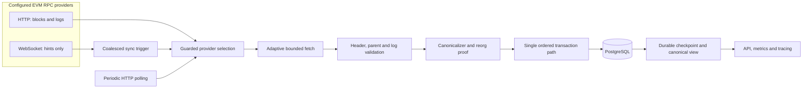

# ReorgGuard

**Reorg-safe, restart-safe EVM event indexing in Go.**

[](LICENSE)

ReorgGuard turns filtered EVM logs into a durable PostgreSQL canonical view. It is a production-style reference implementation for the failure modes hidden behind `eth_getLogs`: provider limits, duplicate delivery, missed WebSocket notifications, chain reorganizations, process death, and RPC failover.

The implementation combines adaptive historical backfill, parent-linked canonical tracking, bounded common-ancestor recovery, atomic branch switching, durable checkpoints, WebSocket hints with HTTP gap recovery, guarded multi-RPC failover, ordered concurrent fetch, an operational API, Prometheus metrics, OpenTelemetry traces, and correctness-gated benchmarks. The [implementation contract](SPEC.md) defines the invariants, and the [evidence ledger](docs/evidence.md) connects each claim to tests and artifacts.

## Try the full failure story

```sh
make demo
```

The deterministic local demo starts PostgreSQL, Anvil, transport fault proxies, and the real ReorgGuard binary. It proves:

`backfill → live event → WS loss → HTTP gap catch-up → A→B→A reorg → SIGKILL/restart → RPC failover → API/metrics → SQL checksum`

The demo deploys a tiny event emitter only to local Anvil and removes its processes and containers on exit. See the [step-by-step demo](docs/demo.md).

## Architecture



WebSocket events can wake synchronization but cannot write canonical state. HTTP closes gaps from the durable PostgreSQL checkpoint. Initial backfill, polling, reconnect recovery, and reorg handling all converge through the same validator and ordered store path. Fetch may run concurrently; commits remain contiguous, so a later range cannot move the checkpoint past an incomplete earlier range.

See [architecture](docs/architecture.md), [canonicality ADRs](docs/adr/), and the [threat model](docs/threat-model.md).

## What happens when things fail?

| Failure | ReorgGuard behavior |
| --- | --- |
| WebSocket disconnects | HTTP polling continues; reconnect starts catch-up from the durable checkpoint. |
| Primary RPC fails or rate-limits | A fallback is checked for chain identity, checkpoint compatibility, head freshness, and required methods before use. |
| Shallow reorg | Parent hashes prove a common ancestor; the old suffix is orphaned and the replacement branch is replayed atomically. |
| Reorg exceeds the configured depth or cannot be proven | Canonical progress stops and readiness becomes unhealthy. |
| Process receives SIGKILL | Restart revalidates PostgreSQL and resumes from the last committed checkpoint. |
| PostgreSQL is unavailable | Work fails within bounded deadlines; no in-memory assumption advances durable progress. |
| Duplicate block or log delivery | Exact repeats are idempotent; conflicting immutable identity is rejected. |
| RPC returns a log outside the configured filter | Local validation rejects the complete response and the checkpoint does not move. |

The complete mapping from failure to permanent regression is in the [failure matrix](docs/failure-matrix.md). Operational recovery steps are in the [runbook](docs/runbook.md).

## Reorg correctness

ReorgGuard retains every observed branch by immutable block and log identity. When branch A is replaced by B, A becomes non-canonical rather than being deleted. If the exact A branch later returns, it can be canonical again without a primary-key collision or duplicate log. The A→B→A path is covered by transaction, restart, live-disconnect, and local Anvil tests.

Canonical flags, replacement data, log visibility, the reorg summary, and the checkpoint change in one PostgreSQL transaction. A failed transaction leaves the previous branch intact. Common ancestry is proven through block hashes and parent hashes; block number alone is never accepted as ancestry.

## Guarded multi-RPC availability

Multiple endpoints improve availability; they are not treated as blockchain consensus. Before failover, ReorgGuard validates the expected chain ID, genesis or configured anchor, the durable checkpoint block and completed filtered log set, provider head, and required RPC methods. Wrong-chain and history-incompatible endpoints are rejected. A provider presenting a plausible new fork still goes through the same bounded reorg engine.

This policy cannot establish global chain truth or detect a plausible omission from `eth_getLogs`. Choosing trustworthy providers remains an operator responsibility. See [ADR-0008](docs/adr/0008-rpc-eligibility-and-failover.md).

## Operational API and observability

The loopback read API is specified in [OpenAPI](api/openapi.yaml):

| Route | Purpose |
| --- | --- |
| `GET /v1/status` | Durable and remote heads, lag, checkpoint age, last reorg, provider and WebSocket state |
| `GET /v1/logs` | Canonical-only log pages with bounded filters and stable ordering |
| `GET /health/live` | Process liveness independent of dependencies |
| `GET /health/ready` | Database, safe HTTP progress, fork state, and lag policy |
| `GET /metrics` | Prometheus exposition with bounded-cardinality labels |

Log pages use keyset pagination and carry the canonical revision. A reorg invalidates an old cursor with HTTP 409 rather than mixing results from two canonical projections. Structured logs redact provider URLs, and optional OpenTelemetry spans cover RPC reads, validation, canonical transactions, and checkpoint updates. See the [observability reference](docs/observability.md).

## Correctness-gated benchmark

The deterministic benchmark indexes 1,024 blocks against a local HTTP fixture and PostgreSQL 18.6. Every run checks the checkpoint, canonical row counts, parent continuity, duplicate suppression and projection checksum before it reports throughput. Run `make benchmark` to generate local raw results under `docs/benchmarks/raw.json`, then validate them with `python3 scripts/validate-benchmark.py docs/benchmarks/raw.json`. The [methodology](docs/benchmarks/README.md) describes the workload and limits. Results belong to the machine and source commit that produced them; they are not a production SLA.

## Run and verify

Prerequisites: Go **1.27.1**, Docker, Foundry **1.8.4** (`anvil`, `forge`, `cast`), Python 3, PostgreSQL `psql`, `rg`, and `make`. The complete release gate also uses govulncheck **1.8.0**, actionlint **1.7.12**, Trivy **0.75.0**, and Syft **1.54.0**.

```sh
make demo              # deterministic end-to-end failure demonstration
make benchmark-smoke   # short benchmark plus correctness gate
make verify            # full local gate, including a clean-clone replay
make benchmark         # regenerate the optional 11-run measured workload
```

The first run downloads public Go modules, tool binaries, scanner databases, Solidity compiler, and container images. No private RPC credentials are needed. Safe configuration names are documented in [.env.example](.env.example); the service accepts configuration through the environment. The default mode performs one HTTP catch-up and exits. `REORGGUARD_SYNC_MODE=live` enables continuous polling and optional WebSocket hints.

The multi-stage [Dockerfile](Dockerfile) produces a static `scratch` image, runs as numeric UID/GID 65532, and supports a read-only root filesystem. The operational API binds to loopback inside the container, so container deployments need a same-network-namespace client or an explicitly configured trusted proxy.

## Engineering evidence

| Area | Evidence |
| --- | --- |
| Correctness and verification | [Evidence ledger](docs/evidence.md) |
| Failure behavior | [Failure matrix](docs/failure-matrix.md) |
| Architecture and transaction boundaries | [Architecture](docs/architecture.md) |
| Trust boundaries | [Threat model](docs/threat-model.md) |
| Operational recovery | [Runbook](docs/runbook.md) |
| Design decisions | [Architecture decision records](docs/adr/) |
| API contract | [OpenAPI 3.0](api/openapi.yaml) |
| Benchmark method | [Benchmark report](docs/benchmarks/README.md); `make benchmark` generates local raw evidence |
| Supply-chain inspection | `make verify` generates and checks a local SPDX SBOM and unsigned build metadata |

## Security and limitations

- RPC providers remain trusted data sources. Multiple providers do not form consensus.
- Plausible omitted `eth_getLogs` entries cannot be detected cryptographically by this indexer alone.
- Automatic reorg recovery is bounded by configured depth and retained local ancestry.
- The API is a loopback operational surface; public exposure requires an appropriate network and authentication policy.
- Benchmark results are local evidence, not a production capacity claim or SLA.
- Local provenance metadata is unsigned and is not a signed public attestation.
- The project has no production operating history and has not received a professional security audit.

## License

ReorgGuard is licensed under the [Apache License 2.0](LICENSE).
