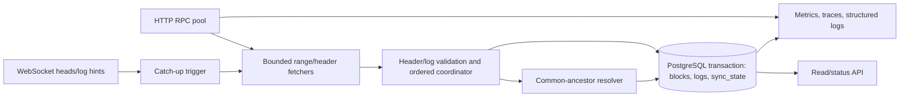

# Architecture

Status: implemented architecture. The correctness-gated benchmark, scratch/non-root reference image, supply-chain checks, and clean-clone gate do not change canonicality. See `SPEC.md` for normative behavior and ADRs for decisions.

RPC data crosses an untrusted external boundary into validation. PostgreSQL is the durable state boundary. The read API crosses a loopback client boundary with bounded pages, deadlines and concurrency. WebSocket supplies latency hints, never durable coverage. HTTP supplies one-shot and long-running catch-up/reorg repair from the durable checkpoint.

## Checkpoint verification at a moving head

Checkpoint verification binds immutable header and filtered-log comparisons to the stored checkpoint hash. After a height-bound range-log query, another height lookup distinguishes movement to a new hash from corruption of the old hash. Movement enters bounded reconciliation or retry without a durable unsafe marker; a same-hash change to parent, timestamp or completed filtered logs remains an identity failure in both direct and pooled modes. Before interpreting movement, each range log explicitly naming the checkpoint hash is compared to the stored row with `model.EqualLog`; changed payload or an unknown log index is an identity error. A different block hash is not compared to the old payload. Empty height-bound responses remain ambiguous, while hash-bound reads still verify the complete filtered set.

## Measurement and release boundary

`scripts/benchmark.py` launches the normal binary against a deterministic localhost JSON-RPC fixture and a fresh PostgreSQL 18.6 database for each run. The fixture generates parent-linked immutable headers and sparse/dense/mixed filtered log sets, including exact duplicate deliveries. Serial, four-worker and eight-worker configurations traverse multiple adaptive ranges. Before emitting any rate, an independent SQL query proves checkpoint/head, canonical counts, parent continuity, zero duplicate canonical logs and an exact SHA-256 over ordered immutable fields against a fixture-derived reference. The harness records environment, configuration, fixture-observed p50/p95 HTTP service time, process CPU and peak RSS. The 96-block CI smoke additionally proves real RPC overlap in the parallel path. See [benchmark method](benchmarks/README.md); local service time is not public-provider round-trip latency.

The multi-stage [Dockerfile](../Dockerfile) pins a Go builder image digest and produces a static `scratch` runtime with CA certificates, a numeric non-root user and no writable-root requirement. The [image test](../scripts/verify-image.py) uses temporary local PostgreSQL and fixture RPC, checks read-only operation, liveness/readiness and SIGTERM, and removes its containers. `scripts/verify-supply-chain.sh` runs govulncheck, Trivy source/image scanning, a credential-pattern scan, Syft SPDX generation and local unsigned build-metadata validation. The source uses a fixed WebSocket dependency version with the known GO-2026-6278 fix. The unsigned local provenance records target-specific `linux/arm64` and `linux/amd64` executable digests. The supply-chain gate compares the current image against its declared target because image IDs may differ solely from build metadata; cross-compilation checks the other target identity without claiming it was executed locally. This scanner set cannot prove absence of all defects or malicious dependencies.

`make verify` includes every project gate and a temporary `git clone --no-hardlinks` replay. The clone runs the normal gate, a separate Anvil demo, benchmark smoke and image build without copied untracked files. The nested gate skips only another clone to prevent recursion. Generated benchmark results, the SBOM and local provenance record the source commit used to produce them. Regenerate them after any source change. GitHub Actions use least-privilege read permissions and third-party actions pinned by full commit SHA. Hosted CI can run the same local gates without private RPC credentials.

## Operational view

`api/openapi.yaml` defines five read-only routes. `cmd/reorgguard` starts the `net/http` server only in live mode with an explicit loopback `REORGGUARD_API_ADDR`; it owns shutdown with a two-second server deadline and applies a five-second socket write deadline to prevent slow readers from retaining capacity. A terminal live error leaves the process and API alive but unready until SIGTERM. `/health/live` never checks dependencies. `/health/ready` reads PostgreSQL checkpoint/canonicality and the live loop's latest safe HTTP sweep state; an isolated WS outage is ready if HTTP fallback is healthy. `/v1/status` joins a durable snapshot with live and provider health, exposing logical endpoint names only. `/v1/logs` uses a read-only repeatable-read transaction, canonical-block join, keyset order, 100-row maximum and a cursor bound to the canonical revision; reorgs invalidate old cursors. The database stores the last committed reorg summary and checkpoint update time transactionally. Migration 002 adds those fields and page/filter indexes ([ADR-0010](adr/0010-operational-snapshot-and-local-api.md)).

`/metrics` mounts the existing reorg/live/pool fixed-series metrics plus durable head/lag/age gauges, backfill range and log counters, and single-endpoint RPC counters when no pool is configured. Labels are bounded fixed methods, states, reasons and configured logical endpoint IDs. Structured logs use safe operation names and do not include full URLs or raw provider/driver errors. `REORGGUARD_TRACING=stdout` enables local OTel JSON spans through HTTP sweeps, RPC reads, validation, canonical transactions and checkpoint updates; `off` leaves a no-op tracer. See [observability](observability.md) for metric meanings and [demo](demo.md) for the local Anvil proof.

## Live synchronization

`REORGGUARD_SYNC_MODE=live` first runs the existing HTTP coordinator. A single WebSocket worker verifies chain ID/genesis, subscribes to `newHeads` and matching logs, reads bounded messages, and owns heartbeat/reconnect. Heads are needed for empty blocks; log notifications including `removed=true` can wake reorg detection sooner. Both feed a capacity-one wake channel. A single caller-owned sync loop handles all wakes, periodic polls, and reconnect sweeps by reading the HTTP head and invoking `Coordinator.RunTo`. Startup and every sweep revalidate the durable checkpoint and network anchor. Only the append/reorg transactions can change canonical SQL state. Lost, repeated, stale, out-of-order, or coalesced notifications affect timing, not correctness.

The WS connection attempts are bounded by dial/read timeouts and capped exponential backoff with up to 25% jitter. A WS outage leaves HTTP polling active. A malformed notification drops that connection and triggers reconnect; a wrong WS chain/genesis is a terminal incompatible-endpoint error. Transient HTTP/DB failures make live readiness unhealthy and retry on the next poll. Proven unsafe reorg state remains fail-closed. The poll interval is configurable; each sweep has a two-minute deadline. A burst creates no per-event goroutines. Shutdown cancels the sweep, closes the WS connection, joins its heartbeat/reconnect worker, then closes the DB pool within main's five-second SIGTERM deadline. SIGKILL recovery still starts from PostgreSQL only. See [ADR-0007](adr/0007-ws-hints-single-http-writer.md).

Internal live status distinguishes caught up, bounded lag, WS degradation with healthy HTTP, HTTP unavailable, and unsafe canonicality. Fixed-series counters cover WS connection/reconnect/backoff, hint and stale/duplicate counts, removed hints, HTTP catch-up ranges, polling fallback, lag, and enumerated transport failures. The service mounts these counters on the loopback operational API.

## Guarded HTTP pool and parallel fetch

`REORGGUARD_RPC_HTTP_URL` names `primary`; `REORGGUARD_RPC_FALLBACK_URLS` adds up to three configured `fallback_N` endpoints. A `Pool.Sweep` serializes canonical sweeps, reads the durable PostgreSQL checkpoint, and probes each eligible endpoint under a timeout. The probe checks chain ID, genesis by number and hash, a configured non-genesis start anchor, current head, the checkpoint header by number and immutable header/log-set identity by hash, and both range and block-hash `eth_getLogs` operations as applicable. An endpoint must be at or ahead of the durable checkpoint and reproduce the old checkpoint by hash, including immutable header and complete filtered-log identity. A provider that reports a new hash at that height may propose a fork when it is already active or when a fresh process has no active endpoint. The existing common-ancestor, parent, depth and transaction rules still decide whether it can commit. A checkpoint-relative mismatch is remembered only for the exact durable checkpoint and revalidated after it moves; wrong chain/genesis/anchor or missing required method remains a process-lifetime hard reject. A behind or unavailable endpoint cannot advance progress. See [ADR-0008](adr/0008-rpc-eligibility-and-failover.md).

The selected endpoint is pinned for the complete coordinator pass. Among currently eligible endpoints, highest reported head wins; configured order breaks ties. This is an availability/freshness policy, never a vote or proof of canonicality. A transient failure marks that endpoint unavailable/rate-limited/degraded with a finite cooldown, then a bounded next attempt rereads PostgreSQL and probes a replacement. A failed endpoint cannot re-enter the same sweep when its cooldown expires during that work. It resumes from the exact durable checkpoint; already committed earlier ranges remain. If no safe source exists, canonical progress stops and live readiness becomes unhealthy. Endpoint states and fixed-label request counts/latency, selection, failover reason, head, compatibility, adaptive window and worker gauges are available through `Pool.Status` and the `/metrics` route; no credential-bearing URL enters those values. Live WS hints still only wake an HTTP pool sweep.

`REORGGUARD_BACKFILL_WORKERS` enables 2–32 parallel range fetch workers; `REORGGUARD_MAX_INFLIGHT_RANGES` bounds planned tasks/results to 2–64 and must be at least the worker count. The default remains the proven serial fetch path. Each wave plans at most the in-flight limit from the current contiguous frontier, fetches headers/logs concurrently on the *pinned* provider, and validates each range internally. Only one ordered consumer compares the next range's first parent to the committed frontier and invokes the existing `Store.Append` transaction. Later results can wait in bounded memory, but cannot commit past an earlier range. On a range failure, uncommitted later results are discarded; a provider limit shrinks that provider's adaptive window and retries the same starting height. Fetch workers are canceled and joined before another wave, endpoint switch, or shutdown. Per-endpoint window/growth state is kept across sweeps, so a restrictive fallback does not lower primary's capability. See [ADR-0009](adr/0009-parallel-fetch-ordered-commit.md).

The test-only crashprobe also covers provider switch, in-flight HTTP fetch, an out-of-order buffered result, and a transaction before checkpoint update. The real binary is SIGKILLed at each boundary and restarted against the same PostgreSQL schema. An independent SQL inspector compares checkpoint, contiguous canonical blocks, log ownership/uniqueness, audit history and ordered SHA-256 projection to an uninterrupted run. Production binaries contain no active probe. No schema migration was needed.

## HTTP backfill and storage

`cmd/reorgguard` reads a single chain/address configuration, validates chain ID, genesis, optional non-genesis anchor, and the immutable header and completed filtered-log set at the stored checkpoint through the same validator used by pooled mode. `internal/rpc` limits HTTP call duration and response bytes, parses the required JSON-RPC methods, locally validates each returned log against the configured address and positional topic predicates, and classifies known range-limit formats. `internal/backfill` retries the same starting height with a smaller window, grows only after healthy successes, fetches every header, and calls `internal/model` to validate parent linkage and complete filtered-log sets. `internal/store` owns the PostgreSQL migration, immutable identity checks, one-writer row lock, and transaction that inserts canonical blocks/logs before advancing the checkpoint. Existing fully repeated ranges are verified and accepted as no-ops.

## Reorg reconciliation

`internal/reorg.Coordinator` first runs HTTP catch-up. A checkpoint-hash or parent mismatch starts one bounded reconciliation. `FindAncestor` starts at the remote block at `min(observed target, old checkpoint height)` and walks `parentHash` via `eth_getBlockByHash`, comparing hashes at each retained canonical height. It rejects a skipped height, a parent lookup that returns the wrong hash, missing local ancestor, cycle, or depth beyond the inclusive configured limit. Block number is only a search bound, never proof of ancestry. Replacement logs are fetched with `eth_getLogs` using `blockHash`, so an empty response for another branch at the same height cannot pass as the selected block's log set. `model.BuildRange` validates the entire forward replacement branch before SQL work.

`Store.Reconcile` locks `sync_state`, confirms the expected old checkpoint and canonical ancestor, walks the local old suffix by parent hash, counts orphaned logs, marks the old suffix noncanonical, verifies/inserts and activates each replacement block and its complete filtered logs, and writes the replacement checkpoint last. The partial canonical-height index and checkpoint trigger remain the base schema. An already known orphaned block is reactivated only after immutable header and log-set fields, actual row count, and every log payload match. Canonical log reads join `blocks` with `canonical=true`; old rows remain as audit history. All of these SQL actions commit or roll back together, with no RPC inside the transaction. A fresh HTTP catch-up then fills heights beyond the switched head.

`Engine.Readiness` reports healthy, reconciling, or unsafe. Proven unsafe fork reasons are stored in `sync_state.fail_reason` and block future appends/reconciliation until operator review. Transient fetch/DB errors stop the current process without moving the checkpoint. Reorg counters, depth, orphan counts, ancestor height, and bounded failure reasons are captured by `Metrics`; structured success logs include old head, ancestor, and new head. The service mounts the metrics exposition on loopback.

## Crash and restart boundary

The default executable mode remains a one-shot process; live mode adds the owned loops above. On startup either mode reads the PostgreSQL checkpoint, revalidates the network anchor and stored head against HTTP, then resumes at `checkpoint+1` or reconciles a proven fork. No volatile fetch result is trusted across restart. Append and reorg transactions commit the canonical projection and checkpoint together. A SIGKILL inside either transaction closes its PostgreSQL connection; the server rolls back uncommitted writes. A SIGKILL immediately after commit leaves a complete durable batch, and the next process discovers that checkpoint before fetching.

`internal/crashprobe` is a build-tagged synchronization seam ([ADR-0006](adr/0006-build-tagged-crash-probes.md)). Normal builds compile a no-op. The explicitly tagged test binary reports a named point to a localhost controller and waits for release or SIGKILL. The harness runs that real binary against a deterministic local HTTP JSON-RPC fixture and real PostgreSQL, retaining one schema across death and restart. It separately performs an uninterrupted run in another schema. An independent SQL inspector checks contiguous canonical heights, parent links for canonical and orphaned blocks, log ownership and complete-set fingerprints, duplicate identities, checkpoint validity, total rows, and a SHA-256 checksum over ordered immutable canonical fields. It compares both the pre/post-crash committed snapshots and the recovered/reference snapshots. No test control variable can activate hooks in a normal binary.

SIGTERM cancels the run context. Main waits up to five seconds for RPC/DB cancellation, transaction rollback, and pool close; if this deadline expires it terminates the process. SIGKILL skips cleanup. A paused PostgreSQL container is used separately to prove bounded failure, unhealthy readiness, and successful restart after the database becomes available again. The outage test takes approximately 25 seconds with current DB/pool timeouts; it does not retry indefinitely.

## One ordered commit path

With parallel fetch enabled, a bounded coordinator receives out-of-order results and hands only the next contiguous range to the canonicalizer. For an append, the writer checks the first parent against the committed head. The branch switch remains a single transaction. The same store writer is used in serial, parallel and live modes.

The database uses an indexed canonical-height uniqueness rule and foreign keys. The log read query joins the block table and filters `canonical=true`, so orphaned logs remain useful for identity checks but are invisible as canonical data. The checkpoint names the end of a contiguous run, not merely the last log-bearing block. All network work occurs before the transaction; at commit, an expected checkpoint check prevents stale fetched work from overwriting newer state.

## Recovery and operations

On start, both modes read the durable checkpoint, verify network anchor/chain ID and checkpoint history over HTTP, and resume from the first uncovered height. A selected previously verified endpoint with a hash mismatch invokes bounded reconciliation. Live mode also repeats this check on WS reconnect and every poll. A durable unsafe marker prevents automatic retry; operator steps are in `docs/runbook.md`. Automatic reset of history is forbidden.

## Bounded resources

Current code bounds RPC and DB call time, total range deadline/attempts, range sizes, result bytes/log count, DB pool size, WS message size, reconnect delay, wake queue size, endpoint count/probe/switch attempts, parallel worker/in-flight result counts, API page size, API request time and concurrent API requests. Cancellation stops a sweep, joins workers, and rolls back uncommitted DB work; SIGTERM has a process-level five-second deadline. Reorg/live/pool metrics use fixed or configured bounded label vocabularies.

## Design assumptions

- One deployment handles one chain and fixed filter. Dataset identity includes the filter fingerprint, chain ID, and trusted genesis/anchor hash.
- No pruning of seen branch identity is needed for the first release; the max reorg policy still bounds automatic reconciliation. Missing-local-history remains a fail-closed test case.
- The provider is not a cryptographic proof of complete `eth_getLogs` results. Header/log consistency checks and multi-endpoint health reduce mistakes but do not prove omission-free results against malicious providers; this residual risk is explicit in the threat model.
- Safe/finalized head values are observational if available and may retreat. They do not bypass canonical parent validation.

## Upstream basis

Geth documents that subscriptions do not replay past events, are tied to a connection, and may repeat same-height heads or send `removed=true` logs on reorg: <https://geth.ethereum.org/docs/interacting-with-geth/rpc/pubsub>. PostgreSQL 18 supports partial unique indexes, which can enforce one canonical block per height: <https://www.postgresql.org/docs/18/sql-createindex.html>.

## Additional trust-boundary checks

A provider response may contain extra, structurally valid logs; the RPC parser and both canonical fetch paths now reject any row that fails the fixed address/positional topic filter. If an upstream fork changes only uncommitted ranges above the durable checkpoint, the coordinator retries a bounded fresh HTTP read. A canceled candidate recheck retains the cancellation error, leaves the durable unsafe marker unset and permits a later retry. Confirmed deep/corrupt ancestry remains fail-closed. The benchmark artifact carries source, harness, binary target/digest, dataset and distinct run identities; its validator checks throughput arithmetic and observed parallel overlap. It is unsigned local measurement evidence.
